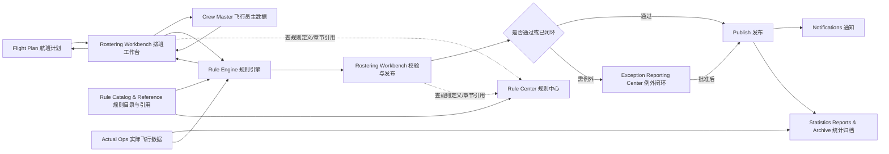
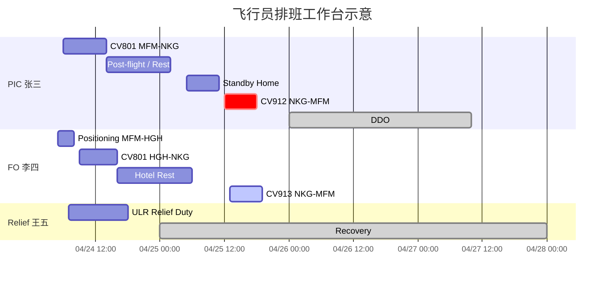
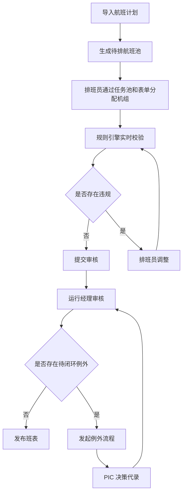
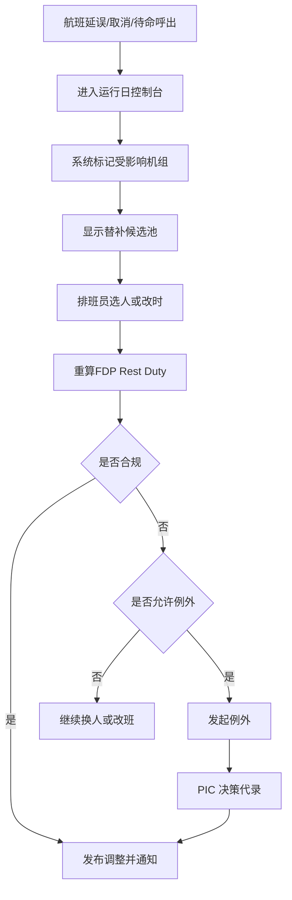
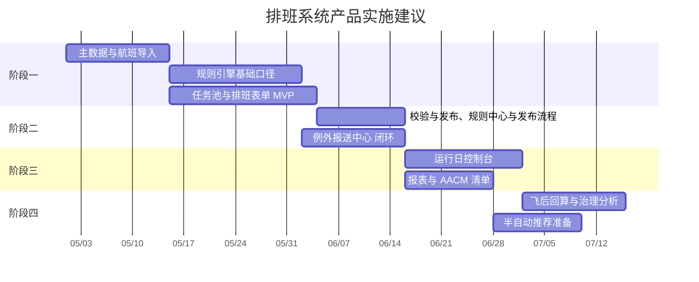

# 飞行员排班系统产品设计方案

## 1. 文档定位

本文件从产品经理视角，基于当前已有的飞行时间与休息限制规则、FOM Chapter 7 和现有 FRD，设计飞行员排班系统的产品结构、业务流程、页面方案、核心交互和可视化方式。

本文件重点回答以下问题：

1. 这套系统应该如何被业务团队真正使用。
2. 甘特图式排班界面应该如何设计，才能同时承接“排班、校验、调整、例外、归档”。
3. 如何让复杂法规规则转化成“排班员看得懂、能操作”的产品体验。
4. 为后续系统实施，产品上要先做什么、后做什么。

## 2. 产品愿景

打造一套围绕飞行员疲劳管理和合规排班的运行产品，让排班员、运行经理和飞行员在同一个系统里完成以下闭环；系统管理员仅承担账号、字典、参数和权限等系统治理职责：

- 看见未来班表
- 编排和调整机组
- 实时看到法规和疲劳风险
- 处理可例外场景
- 发布并通知飞行员
- 飞后回算并形成审计记录

这套系统不是单纯的“班表录入工具”，而是“排班决策工作台 + 风险控制台 + 合规归档台”。

## 3. 核心用户与使用场景

### 3.1 核心用户

| 用户 | 角色定位 | 主要诉求 | 关键动作 |
|---|---|---|---|
| 排班员 | 核心操作者 | 快速编排、少出错、统一维护飞行与地面状态占位 | 分配航班、插入休息、维护/导入模拟机培训、地面培训、值班计划、呼出待命、发起例外 |
| 运行经理 | 审核与运行控制用户 | 把控整体风险、审核与发布班表、处理覆盖与高风险场景 | 审核班表、处理高风险、批准航班覆盖培训/地面计划、发布班表 |
| 飞行员 | 被排班与反馈用户 | 看懂个人班表并反馈自身状态 | 查看班表、确认已读、申报 fatigue/不适、反馈个人冲突 |

### 3.2 典型场景

| 场景 | 产品目标 | 关键处理 |
|---|---|---|
| 月度排班 | 先形成大盘班表，尽量在计划阶段消除明显违规 | 按航班/按飞行员双视图编排，实时校验 |
| 周度滚动修订 | 对新增航班、训练、请假、机组变化快速重排 | 保留原班表基础上增量调整 |
| 培训/模拟机/地面值班手工录入 | 支持排班员直接把飞行员地面状态录入系统 | 形成独立色块，占位避让 |
| 培训/模拟机/地面值班批量导入 | 接收培训或其他计划来源并转成排班占位数据 | 导入后自动进入甘特图 |
| 培训计划与航班冲突识别 | 在编排时及时发现飞行与培训冲突 | 冲突色块高亮，显示覆盖影响 |
| 航班优先覆盖培训块 | 在必要时让航班覆盖培训安排 | 由运行经理批准，系统自动留痕 |
| 运行日延误调整 | 在分钟级变化中快速重排 | 重算 FDP、rest、后续连锁影响 |
| 待命呼出 | 从待命池快速找到可接班机组 | 自动筛选可用人选和风险 |
| 飞行员查看与确认 | 飞行员掌握个人班表与变化 | 查看班表、确认已读 |
| 飞行员 fatigue/不适申报 | 把飞行员状态反馈纳入排班闭环 | 进入“待审核限制态”，待运行经理处理 |
| 例外闭环 | 处理 Discretion / Reduced Rest / CDR | 发起申请、按规则进入决策与自动留痕 |
| 飞后归档 | 用实际运行更新合规与统计 | 回算累计小时、block time、报送清单 |
| AACM 报送准备 | 对需监管留痕的事件形成结构化输出 | 自动进入待报送列表 |

## 4. 产品设计原则

### 4.1 规则透明且可追溯

用户看到的不是“系统说不行”，而是：

- 违反了哪条规则
- 这条规则属于哪一类
- 为什么违反
- 涉及哪段 flight duty、ground duty、training / simulator / standby / positioning / rest / DDO / recovery / sector 或其他地面状态占位
- 来源于 FOM 的哪个章节 / 条款 / 页码
- 当前系统使用的是哪个规则版本
- 可否例外
- 需要谁处理

如果同一对象同时命中多条规则，系统必须全部显示，不能只保留最严重一条。

### 4.2 一个工作台承接主流程

排班员最常用的操作必须集中在一个主工作台里，不应频繁跳多个模块。

### 4.3 时间线优先

飞行员排班本质是连续时间问题，因此产品必须保留时间轴态势视图，但一期的操作核心是任务池、表单、详情抽屉和校验与发布。甘特图负责展示连续时间关系、风险位置和状态跳转，不作为业务事实编辑器。

一期排班工作台按“待排航班 -> 保存草稿 -> 校验与发布 -> 发布 -> 发布后运行日调整 -> 飞后归档”收口。二期按 [PHASE2_RULE_VALIDATION_CLOSURE.md](</D:/paiban2/PHASE2_RULE_VALIDATION_CLOSURE.md>) 收敛为规则命中池和规则中心展示：发布门槛、同一机组时间重叠、航班与状态块冲突接入校验与发布、运行日调整和规则中心。完整规则引擎进入三期，见 [PHASE3_RULE_ENGINE_BACKLOG.md](</D:/paiban2/PHASE3_RULE_ENGINE_BACKLOG.md>)，包括 FDP/FTL、preceding rest、DDO 34h + local nights、连续 duty、28 天累计、跨时区 recovery、Standby、Positioning、Discretion/CDR/AACM 等真实计算。

### 4.4 风险前置

系统在排班表单提交、运行日调整和归档保存时立即给出风险，不要等到发布前才暴露问题。

### 4.5 双视角切换

同一套数据必须支持：

- 按航班排班
- 按飞行员看连续 flight duty / ground duty / training / simulator / standby / positioning / rest / DDO / recovery / 其他地面状态计划

飞行任务和地面状态计划必须共用同一条时间轴，不能在产品定义上被拆成两套独立分类体系。

### 4.6 规则分类与严重级别分层展示

规则展示采用双维度设计：

- 主颜色按规则分类展示
- 严重级别继续独立展示，不与主颜色混用

规则分类颜色固定为：

- `硬校验` = 红色
- `告警/留痕` = 橙色
- `治理提醒` = 蓝色

三分类来自系统对 FOM Chapter 7 的产品化整理，不是 FOM 原文直接定义的正式分类；其原始依据是 [FOM Chapter 7.pdf](</D:/paiban2/FOM Chapter 7.pdf>) `7.1.5.2 / Page 9` 中 `must / will` 与 `should / may` 的语义层级。

### 4.7 国际化与时区一致性

系统必须支持：

- `中文 / English` 界面切换
- `UTC / UTC+8` 展示时区切换
- 一级入口、父菜单、子菜单、页面标题、按钮、表单字段、状态标签、告警提示和导出预览同步切换
- 用户偏好保存语言和展示时区；未设置时默认中文与 UTC+8

产品口径固定为：

- 数据库存储统一使用 UTC
- 页面展示允许用户按偏好切换 UTC 或 UTC+8
- 规则计算不因展示时区切换而改变
- 移动端和桌面端共享同一套语言与时区偏好

### 4.8 展示一致性

产品展示必须全站一致，不能出现同一类信息在不同页面呈现不同格式的情况。

固定要求：

- 日期统一使用 `YYYY-MM-DD`
- 日期时间统一使用 `YYYY-MM-DD HH:mm`
- 含时区日期时间统一带 `(UTC)` 或 `(UTC+8)` 标识
- 日期区间统一使用 `开始 ~ 结束`
- 中英文切换后，同一页面的标题、按钮、字段标签、提示语必须同时切换
- 中英混合数据在列表、侧栏、弹窗、导出预览中不得出现乱码

## 5. 产品结构总览

## 5.1 一级导航

旧浅色前端设计包和 `apps/web/src/imports` 历史文件只作为导航布局、展开效果、视觉密度和浅色主题参考；不得作为功能需求、菜单文字、角色权限、API、数据模型、算法能力或验收范围来源。正式菜单名称、层级和业务入口以本产品结构、主 FRD、架构文档和专项开发文档为准。

| 一级模块 | 子菜单 | 定位 |
|---|---|---|
| Dashboard | direct entry | 运行与排班风险总览 |
| Flight Operations Center | Flight Plan、Operations Data | 航班计划、外部任务导入、航班池、航线、飞机和机场时区 |
| Crew Resources Center | Crew Information、Status Timeline、External Work | 飞行员档案、资质、累计状态、执勤日历和计划状态块 |
| Rostering Workbench | Flight View、Crew View、Unassigned Flights、Validation & Publish、Run-day Adjustments、Post-flight Archive | 核心排班工作台，承担排班、校验发布和飞后归档能力 |
| Rule Center | direct entry | 规则目录、规则版本、FOM 来源引用和规则试算 |
| Exception Reporting Center | Exception Requests、CDR / AACM | 例外、PIC 决策、CDR 和 AACM 报送 |
| Statistics Reports | direct entry | 统计图表、机组小时、执勤休息、DDO/Recovery、归档报表、数据导出和导出历史 |
| Admin | Basic Config、Account Management、Role & Permission、Rule Config、Dictionary、Airport & Timezone、Import Mapping、Notification Template、User Preference | 基础配置、权限、字典、用户偏好和系统治理 |
| Pilot Portal | My Roster、My Alerts、Status Report、My History、My Preferences | 飞行员移动端与个人信息入口 |

## 5.2 产品架构图



说明：

- `Rule Center` 是规则查询、来源引用和版本查看中心，不是校验通过后的顺序下一步。
- 正常主路径是 `Rostering Workbench -> Rule Engine -> Validation & Publish`，校验通过后在同一工作台完成发布。
- 只有存在可例外问题时，才从 `Validation & Publish` 进入 `Exception Reporting Center`，批准后回到工作台发布。
- `Flight Plan` 与 `Rostering Workbench` 为双向关系：`Flight Plan` 提供航班任务，`Workbench` 回写分配结果、缺口状态、归档状态和发布状态。
- `Crew Master` 与 `Rostering Workbench` 为双向关系：`Crew Master` 提供飞行员主档、资质、基地和限制条件；`Workbench` 回写飞行员状态、累计时长和飞后归档结果，但不直接修改基础主档与资质主档。
- 全局页面框架固定提供：当前系统时间、语言切换、展示时区切换。

### 5.1 航班运行中心资料维护

航班运行中心不再使用只读汇总卡片作为正式功能。产品形态固定为：

- `航班计划`：导入批次、批次历史、导入校验、字段映射入口和航班池维护。
- `运行资料`：页内 tabs 管理航班、航线、机场时区、飞机资料。
- 航班池和运行资料均真实落库，新增/编辑/停用后可被排班工作台、甘特图、飞后归档和报表复用。
- 已发布或已归档航班的时间、取消、换人等变更必须走运行日调整，不能在基础资料页直接破坏已发布事实。

### 5.2 机组资源中心资料维护

机组资源中心是飞行员主数据与可用性上下文，不是单一人员列表：

- `机组信息`：页内 tabs 管理人员档案、资质/执照、小时与限制、执勤日历。
- `状态时间线`：维护 DUTY / TRAINING / REST / DDO / STANDBY / RECOVERY 等计划状态块，规则有效性由后续规则引擎判定。
- `外部工作`：维护外部工作、外部飞行、请假、不可用时间和公司外部任务；保存后影响机组可用性，并进入机组视图甘特展示。
- 小时与限制本轮只展示已有滚动值和 actual-only 口径，FDP/FTL/DDO/Recovery 完整计算不在本轮新增。

## 6. 核心产品方案：甘特图式排班工作台

### 6.1 为什么以甘特图为核心

飞行员排班不是简单的“航班分人”，而是连续的 duty、rest、LNP、WOCL、DDO、recovery、standby、positioning 组合。只有时间轴产品才能同时回答：

- 某人此刻是否可用
- 前序 rest 是否满足
- 后续班表是否被连锁影响
- 连续 duty / 夜航 / 跨时区 是否积累过高

因此主界面采用“任务池 + 表单化排班工作台 + 甘特态势视图”的组合最合理。甘特态势视图固定使用 `vis-timeline` 官方 `Timeline` 实例承载，通过适配层做航空运行态势表达，不从零自研甘特渲染引擎，也不沿用无业务语义的默认样式。

### 6.2 主工作台能力

主工作台不在本阶段写死页面布局，只定义必须承载的核心能力：

- 支持按航班和按飞行员两种主要视角切换
- 支持以甘特图时间轴展示 Flight / Positioning / Standby / Rest / DDO / Recovery / Training 等业务块
- 支持查看未分配航班、待命池、Positioning、Ground / Simulator / Duty Plans 等待处理任务
- 支持展示 Rule hits、多条规则详情、规则分类标签、Severity、章节引用和 PDF 跳转
- 支持展示航班归档状态和关联飞行员归档状态
- 支持通过任务池、排班/调整表单、详情抽屉、例外流程和飞后归档工作区执行替换、插入休息、发起例外、飞后归档、查看历史等动作
- 支持筛选条件、重算、提交审核和发布入口

界面排布允许后续根据原型和实现阶段再细化，但以上能力必须在同一主工作台上下文内完成，不拆成割裂的多页面流程。

### 6.3 视图模式

| 视图 | 用途 | 适用人 |
|---|---|---|
| Crew Timeline View | 以飞行员为行，看连续 duty / rest / DDO / recovery | 排班员、运行经理 |
| Flight Assignment View | 以航班为行，看航班需要哪些机组、谁已分配 | 排班员、运行经理 |
| Day-of-Ops View | 以运行日事件为中心，看受影响航班和替补机组 | 排班员、运行经理 |
| Risk Heatmap View | 聚焦高风险 crew、连续夜航、累计超限 | 排班员、运行经理 |

### 6.4 甘特条块设计

| 条块类型 | 展示内容 | 视觉建议 |
|---|---|---|
| Flight Duty | 航班号、航段、起降站、STD/STA | 主色块 |
| Positioning | 调机、移动 | 斜纹色块 |
| Standby | 待命类型、时段 | 虚线边框 |
| Rest | 休息 | 浅灰块 |
| DDO | Domestic Day Off | 绿色块 |
| Recovery | 恢复期 | 深绿色块 |
| Ground Duty / Simulator | 培训、办公室、模拟机 | 黄色块 |
| Exception Pending | 待 PIC 决策代录 | 红色角标 |
| Rule Overlay | 规则分类叠加层 | 角标 / 边框 / 弹层标题 / 详情标签 |
| Archive Overlay | 飞后归档状态叠加层 | 统一归档色块标识 |

规则分类颜色体系：

| 分类 | 颜色 | 使用方式 |
|---|---|---|
| 硬校验 | 红色 | 红色标签、红色边框、红色主提示 |
| 告警/留痕 | 橙色 | 橙色标签、提醒图标、橙色提示条 |
| 治理提醒 | 蓝色 | 蓝色标签、信息图标、蓝色提示条 |

颜色叠加原则：

- 业务块底色始终表示业务类型，不被规则分类颜色替代。
- 规则分类颜色通过角标、外边框、悬停弹层标题条和右侧详情栏标签叠加。
- 严重级别通过文案、图标和动作权限表达，不占用业务块主色。
- 飞后归档状态通过第二层色块展示，不替换 Flight 主色块。

飞后归档状态视觉：

| 状态 | 展示建议 |
|---|---|
| 未归档 / 部分归档 / 逾期未归档航班 | 统一未归档色块 |
| 已归档航班 | 已归档色块 |

### 6.5 甘特态势视图交互设计

#### 核心交互

- 通过任务池和排班/运行日调整表单分配航班、替换机组、插入 rest / DDO / EXB / recovery
- 点击 duty block 查看完整计算详情
- 从详情抽屉进入规则详情、例外申请、运行日调整或归档详情
- 悬停展示 rule summary
- 点击红色风险点直接跳转规则详情或例外申请
- 点击未归档航班色块打开只读详情或跳转飞后归档详情
- 在飞后归档工作区选择飞行员并打开个人归档表单
- 录入 `actual duty start/end` 与 `actual fdp start/end` 后自动计算 `DUTY / FDP / FLYING_HOUR`
- 对无 `FLYING_HOUR` 的飞行员显式标记“无 FLYING_HOUR”
- 单个飞行员保存后局部刷新航班归档状态，全员完成后自动转正式归档

#### 表单提交后的系统反馈

- 提交后返回规则结果、受影响航班/飞行员、受影响时间窗口和审计记录 ID
- 系统高亮显性冲突，并在校验与发布列出多条规则命中
- 若造成后续班表连锁影响，在详情抽屉和甘特态势视图中显示“受影响区段”

### 6.6 甘特图视觉示意



### 6.7 甘特图上必须直接显示的风险提示

本节只保留必须在甘特图主视图上直接以红色表达的高严重性风险。橙色、蓝色和一般状态类信息不在主时间轴强提示，转入详情栏、校验与发布和规则中心展示。

| 风险类型 | 展示方式 |
|---|---|
| FDP 超限 | 红色边框 |
| Rest 不足 | 红色断点提示 |
| 连续夜航 / LNP 超限 | 红色月牙图标 |
| 连续 duty 天数超限 / 第 7 天违规飞行 | 行首红色警示条 |
| 28 天 FLYING_HOUR 超限 | 行级红色累计警示条 |
| 12 个月 FLYING_HOUR 超限 | 行级红色累计警示条 |
| 7 / 14 / 28 天 DUTY 超限 | 行级红色累计警示条 |
| DDO 不满足要求 | DDO 块红色警示边框或缺口提示 |
| 连续 14 天未满足 2 个连续 DDO | 行级红色连续性警示条 |
| 连续四周周期平均 DDO 不足 | 行级红色累计性警示条 |
| Recovery 不足或缺失 | Recovery 块红色警示边框 |
| 例外待审批 | 红色角标 |
| 硬校验命中 | 红色分类标签 + 红色外边框 |
| 未归档 / 部分归档 / 逾期未归档航班 | 统一未归档色块 |
| 已归档航班 | 已归档色块 |

规则分类颜色只表达“这是什么性质的规则”，不覆盖 Flight / Rest / Training 等业务块的原始底色。

## 7. 页面设计

### 7.1 Dashboard 总览页

#### 页面目标

帮助运行经理在 1 分钟内看清楚当前运行和未来几天的排班风险。

#### 页面模块

- 今日航班总数
- 今日待命人数
- 今日未闭环例外数
- 本周即将超限人员
- 本周连续夜航高风险人员
- CDR 趋势图
- block time 偏差趋势

#### 页面结构

```text
+---------------------------------------------------------------+
| KPI 卡片：今日航班 | 待处理例外 | 即将超限 | 未发布班表        |
+-----------------------------+---------------------------------+
| 左：未来7天风险 crew 列表   | 右：CDR / AACM 报送趋势        |
+-----------------------------+---------------------------------+
| 下：今日航班运行态势 + 高风险站点/航线                         |
+---------------------------------------------------------------+
```

### 7.2 航班视角排班页

#### 页面目标

从“航班是否有人飞、资质是否匹配、是否合规”角度快速分配机组。

#### 页面重点

- 适合月度初排和大批量分配
- 以 flight legs 为主
- 支持一键查看缺口航班
- 支持查看“为什么这个人不能飞”
- 支持从航班色块进入飞后归档流程
- 支持查看该航班关联飞行员归档状态

#### 字段

- Flight No
- Route
- STD / STA
- Aircraft Type
- Required Crew Pattern
- Assigned PIC / FO / Relief
- Risk Status
- Archive Status

#### 飞后归档交互

- 点击未归档或部分归档航班色块，打开只读详情或跳转航班归档详情
- 航班归档详情展示：
  - 航班信息
  - 关联飞行员列表
  - 每名飞行员当前归档状态
  - 进入单个飞行员归档表单的按钮
- 单个飞行员归档表单字段固定为：
  - `actual duty start`
  - `actual duty end`
  - `actual fdp start`
  - `actual fdp end`
  - 自动计算 `DUTY`
  - 自动计算 `FDP`
  - 自动计算/展示 `FLYING_HOUR`
  - `无 FLYING_HOUR` 显式标记
- 单个飞行员保存后，只局部刷新该飞行员状态和航班整体归档状态
- 该航班全部飞行员完成后，系统自动转为正式归档

飞后归档优先级：

- `Post-flight Archive`、归档详情和飞后归档表单是主操作区；甘特图航班色块只作为状态展示和详情跳转入口。
- 排班员可在归档详情录入和保存；运行经理只能只读查看；飞行员不进入后台归档录入；系统管理员不参与业务归档。
- 归档表单保存后必须局部刷新归档色块、飞行员表单状态和航班归档状态，避免整月排班全量重载。

### 7.3 飞行员时间线页

#### 页面目标

从“人是否还能飞、有没有休息好、后续还能接什么任务”角度排班。

#### 页面重点

- 适合做精调、换班和疲劳复核
- 直接看到连续 duty、rest、DDO、recovery
- 支持查看累计小时和历史违规

#### 页面结构

- 顶部：机组头像、基地、角色、机型
- 中间：时间线甘特
- 右侧：累计小时、规则结果、最近 CDR、建议替补

### 7.4 校验结果中心

#### 页面目标

让产品和运行方把“合规问题”从甘特图中抽出来集中处理。

#### 页面模块

- 过滤区：日期、crew、rule、规则分类、severity、状态
- 结果表：对象、Rule Hits 数、Rule ID 标签组、Message、Action
- 明细区：逐条规则展开，显示规则说明、计算输入、证据、处理建议、来源条款、PDF 跳转

### 7.5 规则中心

#### 页面目标

让排班员和运行经理能独立查看当前系统生效的全部合规规则、来源引用和版本状态，而不是只能在违规时被动看到结果。

#### 页面模块

- 过滤区：Rule ID、规则分类、默认严重级别、章节、条款、状态、关键词
- 规则列表：Rule ID、规则名、分类标签、默认严重级别、适用对象、来源章节、条款、页码、版本、状态
- 详情区：规则说明、触发条件、处理方式、可否例外、PDF 跳转、最近命中案例

#### 关键字段

- Rule ID
- Rule Name
- Rule Category
- Severity Default
- Applicability
- Trigger Summary
- Source Section / Clause / Page
- PDF Deeplink
- Version / Status / Effective From

#### 关键交互

- 点击章节或页码直接跳转 [FOM Chapter 7.pdf](</D:/paiban2/FOM Chapter 7.pdf>) 对应页
- 按分类、版本状态、关键词快速筛选
- 从 Rule ID 反查最近命中案例
- 对比当前版本与历史版本差异

### 7.6 例外报送中心 页

#### 页面目标

把所有口头例外处理数字化。

#### 页面模块

- 待审批例外列表
- PIC 决策代录箱
- CDR 台账
- AACM 待报送列表
- 被覆盖规则列表与来源引用

#### 关键字段

- Hit Rules
- Flight
- Crew
- Requester
- Reason
- Extension Hours
- Rest Reduction Hours
- Source Section / Clause / Page
- PIC Decision
- Report Required

### 7.7 飞行员端移动支持

#### 页面目标

保证飞行员在手机浏览器中完成最核心动作，不要求在移动端完成复杂排班。

#### 页面范围

- `My Roster`
- `My Alerts`
- `状态申报`

#### 产品要求

- 手机宽度下必须可用
- 主操作按钮不得被遮挡
- 日期切换、状态申报、提醒查看必须在触屏下完成
- 移动端沿用桌面端相同的语言和时区偏好
- 飞行员权限采用两层模型：`PILOT` 控制是否可进入飞行员端，`crew_id` 控制能看哪些个人数据。
- 飞行员端只展示当前登录用户绑定 `crew_id` 对应的个人数据，包括个人班表、提醒、状态申报、历史、本人归档摘要和本人相关例外/CDR/PIC 决策记录。
- 飞行员端优先使用 `/api/pilot/me/*` 接口，不让前端传入 `crewId` 决定数据范围。
- 飞行员不得通过 URL、筛选条件或接口 ID 查看其他飞行员数据；越权访问必须被后端拒绝。
- 飞行员状态申报只能为本人创建，不支持代他人申报。

## 8. 关键业务流程设计

## 8.1 编排与发布流程



## 8.2 运行日改班流程



## 9. 规则如何转成产品能力

### 9.1 用户不应直接面对法规条文

产品应把规则翻译为四类用户语言：

| 规则原始类型 | 产品语言 |
|---|---|
| 计算类 | “本次 FDP 上限 11.5 小时，当前已排 12 小时” |
| 限制类 | “连续夜航已达 3 次，不能继续排第 4 次” |
| 例外类 | “允许发起 PIC 裁量，需 CDR” |
| 治理类 | “该机组通勤超过 90 分钟，建议安排住宿” |

### 9.2 规则承接方式

| 产品位置 | 承接内容 |
|---|---|
| 甘特图边框/角标 | 快速显示风险 |
| 右侧详情栏 | 显示完整规则与证据 |
| 校验与发布 | 集中处理所有规则结果 |
| 规则中心 | 查看规则目录、来源引用、版本和命中历史 |
| 例外页 | 承接可例外规则 |
| 报表页 | 承接记录、趋势和复盘 |

### 9.3 规则分类与颜色体系

系统对规则采用“分类”和“严重级别”分层表达：

| 维度 | 用途 | 展示方式 |
|---|---|---|
| 规则分类 | 告诉用户这条规则属于什么性质 | 红 / 橙 / 蓝分类标签 |
| 严重级别 | 告诉用户当前结果需要什么动作 | BLOCK / NON_COMPLIANT / ALERT / INFO |

规则分类定义：

| 分类 | 颜色 | 含义 | 默认产品行为 |
|---|---|---|---|
| 硬校验 | 红色 | 系统必须计算并直接影响排班合法性 | 重点提示，必要时阻断发布 |
| 告警/留痕 | 橙色 | 系统不一定拦截，但必须提示并记录 | 保留动作入口，要求留痕 |
| 治理提醒 | 蓝色 | 偏治理、趋势、组织义务提醒 | 持续提示，进入报表和治理闭环 |

## 10. 数据对象与产品对象映射

| 产品对象 | 业务意义 | 使用页面 |
|---|---|---|
| Crew Profile | 人的信息 | Crew、Workbench、Exceptions |
| Flight Task | 航班任务 | Flight Plan、Workbench |
| Duty Block | 甘特图上的业务块 | Workbench |
| Rest Block | 休息块 | Workbench、Crew |
| DDO / Recovery Block | 休息恢复块 | Workbench、Crew |
| Flight Archive Case | 航班归档任务 | Workbench、Statistics Reports |
| Crew Archive Form | 飞行员归档表单 | Workbench |
| Rule Catalog | 规则目录 | Rule Center |
| Rule Reference | 规则来源引用 | Rule Center、Workbench |
| Rule Version | 规则版本信息 | Rule Center、Admin |
| Violation Hit | 单条命中结果 | Workbench、Rule Center、Exceptions |
| Validation Result | 校验结果 | Workbench、Rule Center |
| Exception Case | 例外单据 | Exception Reporting Center |
| CDR Record | 裁量记录 | Exception Reporting Center、Statistics Reports |

## 11. MVP 产品范围建议

### 11.1 MVP 必做

- Crew 主数据
- 航班计划导入
- 甘特图排班工作台
- Rule Engine 基础计算
- Rule Center
- Validation & Publish
- 发布与通知
- 例外发起与 PIC 决策代录
- CDR 台账
- 飞后归档最小闭环
- 飞行员端移动支持
- 中英文切换
- `UTC / UTC+8` 展示切换

### 11.2 第二阶段

- 运行日控制台
- 候选替补机组推荐
- block time 偏差治理
- 合规报表增强

### 11.3 第三阶段

- 半自动排班推荐
- 排班影响模拟
- 机队/基地策略配置

## 12. 产品实施建议

### 12.1 先做什么

先把“排班工作台 + 规则引擎 + 校验与发布 + 规则中心”打通，因为这是全系统的最小闭环。

### 12.2 为什么这样排

如果没有任务池、表单化排班工作台、规则引擎和规则引用中心，后面的例外、报表、AACM 报送都会失去统一依据。

### 12.3 推荐实施顺序



## 13. 验收标准

### 13.1 产品验收

- 排班员可以通过任务池和排班/运行日调整表单完成机组分配。
- 任意排班动作后，系统能返回规则结果。
- 风险可以从任务池、详情抽屉、甘特态势视图跳转到规则详情。
- 同一对象命中多条规则时，任务池、详情抽屉、甘特态势视图、校验与发布、规则中心展示一致。
- 可例外问题可以直接发起流程，不需要离开系统。
- 飞行员可以在个人视图看到发布后的班表和休息安排。
- 未归档航班能在任务池、归档列表和甘特图上被标记，并可进入飞后归档详情。
- 单个飞行员保存后，航班显示部分归档；全员完成后自动转为已归档。
- 运行经理从甘特图或归档列表进入归档详情时只能只读查看，不能编辑飞行员归档表单。
- 超过 24 小时未整班归档的航班在任务池、归档列表和甘特图上显示逾期状态，并仍可继续完成录入。

### 13.2 业务验收

- 常规航班排班可在系统内完成。
- 跨时区、待命、调机、recovery、DDO 能正确展示在时间线上。
- Discretion / Reduced Rest 能形成完整闭环。
- AACM 需报送事件可以自动识别。
- 任意违规都能追溯到 Rule ID、章节、条款、页码和当前版本。
- 多飞行员航班中，部分飞行员可无 `FLYING_HOUR`，但在 `Duty/FDP` 完整且显式标记后仍可完成归档。

## 14. 与现有 FRD 的关系

本文件是现有 [FRD_Pilot_Rostering_System_Master.md](</D:/paiban2/FRD_Pilot_Rostering_System_Master.md>) 的产品化展开。

两者关系如下：

- Master FRD 负责“规则和系统边界是什么”
- 本文负责“产品如何承接、页面如何设计、用户如何操作”

后续如果你要继续推进完成这套系统，最合理的下一步是：

1. 先把任务池、排班/调整表单、归档详情和校验与发布做成可验收原型。
2. 再接入甘特态势展示。
3. 最后拆前后端开发任务。


